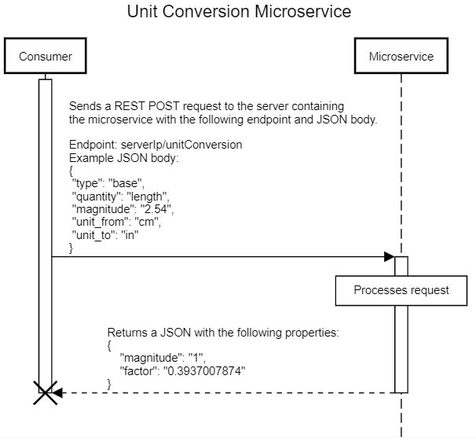

# Unit Conversion API

This API allows for unit conversions to be made with the provided parameters.

## Endpoint
- Make a `POST` REST API request to the follow address with the following `JSON` body.
    - `serverIp/unitConversion`

## Parameters
- `type`: Whether the unit is a base unit (e.g., length is in meters in the SI system) or a derived unit. (string)
- `quantity`: What is being measured (e.g, time, length, mass, etc.).                                     (string)
- `magnitude`: The magnitude of the unit the user wants to convert from.                                  (number with decimals / double)
- `unit_from`: The unit the value is currently in.                                                        (string)
- `unit_to`: The unit to convert the value to.                                                            (string)

    ```json
    {
    "type": "base",
    "quantity": "Length", 
    "magnitude": "2.54",
    "unit_from": "centimeters",
    "unit_to": "inches"
    }
    ```
**Note**: The string values must match a value in the shared dictionary otherwise a status of 400 will be returned. (Shown below).

<br />

## Response
- `Response`: A `JSON` containing the converted magnitude and the conversion factor used.
    
    ```json
    {
    "magnitude": "1",
    "factor": "0.3937007874"
    }
    ```

## UML Sequence Diagram


## Shared Dictionary:
```json
{
    "Length": {
        "inches":           0.0254,
        "feet":             0.3048,
        "yards":            0.9144,
        "miles":            1609.344,
        "nautical miles":   1852,
        "millimeters":      0.001,
        "centimeters":      0.01,
        "meters":           1,
        "kilometers":       1000
    },
    "Time": {
        "microseconds": 0.000001,
        "milliseconds": 0.001,
        "seconds":      1,
        "minutes":      60,
        "hours":        3600,
        "days":         86400,
        "weeks":        604800
    },
    "Mass": {
        "ounces":       0.028349523125,
        "pounds":       0.45359237,
        "short tons":   907.18474,
        "long tons":    1016.0469088,
        "milligrams":   0.000001,
        "grams":        0.001,
        "kilograms":    1,
        "tonnes":       1000
    },
    "Force": {
        "ounces":       0.0625,
        "pounds":       1,
        "Newtons":      0.2248089431,
        "kiloNewtons":  224.8089431
    },
    "Speed": {
        "feet per second":      3.28084,
        "miles per hour":       2.236936,
        "meters per second":    1,
        "kilometers per hour":  3.6
    }
}


```

<!-- title Unit Conversion Microservice
participant Consumer
participant Microservice

activate Consumer
Consumer->Microservice:Sends a REST POST request to the server containing\nthe microservice with the following endpoint and JSON body.\n\nEndpoint: serverIp/unitConversion\nExample JSON body:\n{\n "type": "base",\n "quantity": "length", \n "magnitude": "2.54",\n "unit_from": "cm",\n "unit_to": "in"\n}
activate Microservice
box over Microservice:Processes request
Microservice-(Remove me)->Consumer:Returns a JSON with the following properties:\n{\n    "magnitude": "1",\n    "factor": "0.3937007874"\n}
deactivate Microservice
deactivate Consumer
destroy Consumer -->